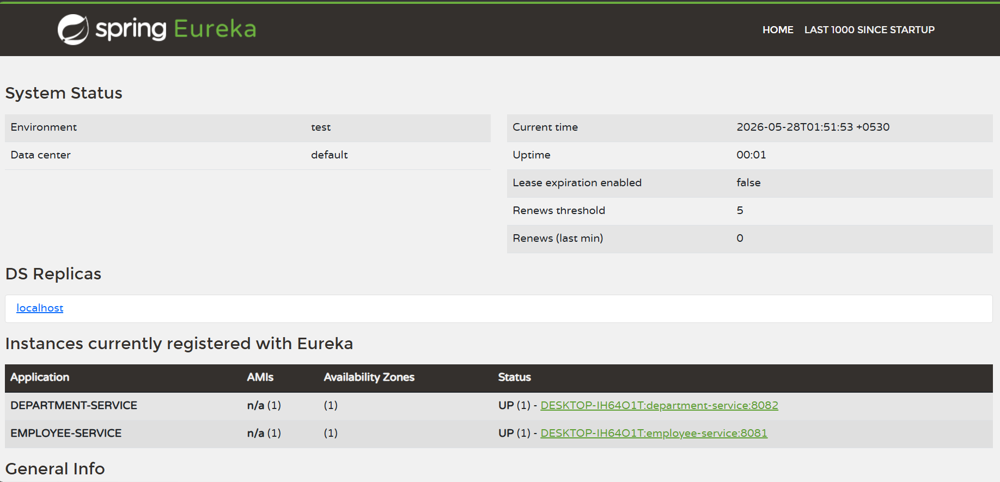

# Employee Management Microservices
Employee Management System built using Spring Boot Microservices architecture with Eureka Service Discovery, DTO design pattern, exception handling, REST APIs, and MySQL integration.

## Services
- Employee Service
- Department Service
- Eureka Service Registry

## Technologies
- Java 17
- Spring Boot
- Spring Cloud
- Eureka Server
- Spring Data JPA
- MySQL
- Lombok

## Features
- Employee CRUD APIs
- Department CRUD APIs
- DTO Architecture
- Global Exception Handling
- Service Discovery
- Microservices Communication Foundation

## Ports
- Eureka Server → 8761
- Employee Service → 8081
- Department Service → 8082

- 
